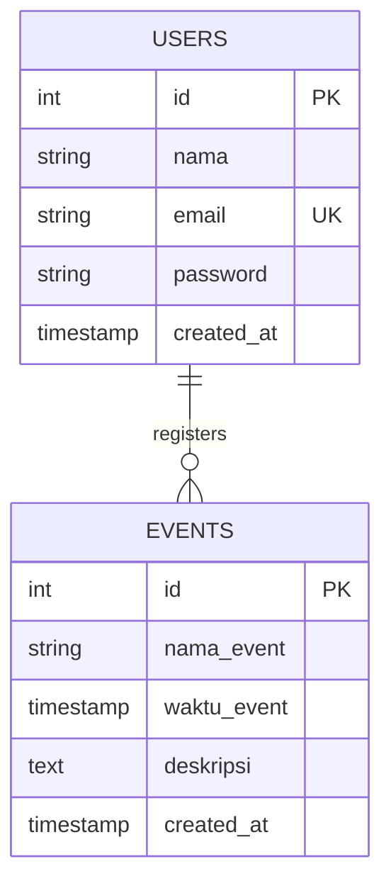

# Database Schema & ERD - Event Campus

## Entity Relationship Diagram (ERD)

```
┌─────────────┐         ┌──────────────┐
│   USERS     │         │   EVENTS     │
├─────────────┤         ├──────────────┤
│ id (PK)     │         │ id (PK)      │
│ nama        │         │ nama_event   │
│ email (UQ)  │         │ waktu_event  │
│ password    │         │ deskripsi    │
│ created_at  │         │ created_at   │
└─────────────┘         └──────────────┘

PK = Primary Key
UQ = Unique Key
```

## Database Diagram (Mermaid)



---

## Table: USERS

**Purpose:** Menyimpan data user/pengguna aplikasi

### Struktur Kolom

| Kolom | Type | Constraint | Description |
|-------|------|-----------|-------------|
| id | SERIAL | PRIMARY KEY | Unique identifier, auto-increment |
| nama | VARCHAR(255) | NOT NULL | Nama lengkap user |
| email | VARCHAR(255) | NOT NULL, UNIQUE | Email user (untuk login) |
| password | VARCHAR(255) | NOT NULL | Password terencripsi (bcrypt) |
| created_at | TIMESTAMP | DEFAULT CURRENT_TIMESTAMP | Waktu pembuatan akun |

### SQL DDL

```sql
CREATE TABLE users (
  id SERIAL PRIMARY KEY,
  nama VARCHAR(255) NOT NULL,
  email VARCHAR(255) NOT NULL UNIQUE,
  password VARCHAR(255) NOT NULL,
  created_at TIMESTAMP DEFAULT CURRENT_TIMESTAMP
);

-- Create index untuk search by email (faster queries)
CREATE INDEX idx_users_email ON users(email);
```

### Sample Data

```sql
INSERT INTO users (nama, email, password) VALUES
('John Doe', 'john@example.com', '$2b$10$hashedpassword1...'),
('Jane Smith', 'jane@example.com', '$2b$10$hashedpassword2...'),
('Budi Santoso', 'budi@example.com', '$2b$10$hashedpassword3...');
```

### Constraints & Rules

- **id**: Auto-generated, tidak boleh NULL
- **nama**: Minimal 1 karakter, maksimal 255 karakter
- **email**: Harus unique dan valid format email
- **password**: Harus ter-hash dengan bcrypt (salt rounds = 10)
- **created_at**: Otomatis terisi saat insert

---

## Table: EVENTS

**Purpose:** Menyimpan data event kampus

### Struktur Kolom

| Kolom | Type | Constraint | Description |
|-------|------|-----------|-------------|
| id | SERIAL | PRIMARY KEY | Unique identifier, auto-increment |
| nama_event | VARCHAR(255) | NOT NULL | Nama event/kegiatan |
| waktu_event | TIMESTAMP | NOT NULL | Waktu pelaksanaan event |
| deskripsi | TEXT | NULLABLE | Deskripsi detail event |
| created_at | TIMESTAMP | DEFAULT CURRENT_TIMESTAMP | Waktu event dibuat/dicatat |

### SQL DDL

```sql
CREATE TABLE events (
  id SERIAL PRIMARY KEY,
  nama_event VARCHAR(255) NOT NULL,
  waktu_event TIMESTAMP NOT NULL,
  deskripsi TEXT,
  created_at TIMESTAMP DEFAULT CURRENT_TIMESTAMP
);

-- Create index untuk search & sorting
CREATE INDEX idx_events_nama ON events(nama_event);
CREATE INDEX idx_events_waktu ON events(waktu_event);
```

### Sample Data

```sql
INSERT INTO events (nama_event, waktu_event, deskripsi) VALUES
(
  'Tech Talk 2024',
  '2024-11-20T14:00:00Z',
  'Diskusi teknologi terkini bersama expert dari perusahaan tech terkemuka. Topik: AI, Machine Learning, Cloud Computing.'
),
(
  'Hackathon Spring 2024',
  '2024-12-01T08:00:00Z',
  'Kompetisi programming 24 jam dengan hadiah total 50 juta rupiah. Terbuka untuk semua mahasiswa dari seluruh universitas.'
),
(
  'Workshop Web Development',
  '2024-12-05T10:00:00Z',
  'Belajar web development dari basic sampai advanced. Stack: HTML, CSS, JavaScript, React, Node.js'
),
(
  'Seminar Entrepreneurship',
  '2024-12-10T13:00:00Z',
  'Sesi motivasi dan sharing pengalaman dari founder startup sukses. Gratis dan terbuka untuk umum.'
),
(
  'Career Fair 2024',
  '2024-12-15T09:00:00Z',
  'Event rekrutmen dengan kehadiran 50+ perusahaan. Kesempatan emas untuk networking dan job interview.'
);
```

### Constraints & Rules

- **id**: Auto-generated, tidak boleh NULL
- **nama_event**: Minimal 1 karakter, maksimal 255 karakter, tidak boleh NULL
- **waktu_event**: Harus berformat TIMESTAMP yang valid, tidak boleh NULL
- **deskripsi**: Opsional, bisa NULL, unlimited text
- **created_at**: Otomatis terisi saat insert

---

## Relationships

### Many-to-One (Events → Users)

**Hubungan:** Satu user bisa register untuk banyak events (future implementation)

```sql
-- Migration: Add future registration table
CREATE TABLE event_registrations (
  id SERIAL PRIMARY KEY,
  user_id INT NOT NULL,
  event_id INT NOT NULL,
  registered_at TIMESTAMP DEFAULT CURRENT_TIMESTAMP,
  FOREIGN KEY (user_id) REFERENCES users(id) ON DELETE CASCADE,
  FOREIGN KEY (event_id) REFERENCES events(id) ON DELETE CASCADE,
  UNIQUE(user_id, event_id) -- One user dapat register 1x per event
);
```

---

## Indexes untuk Performance

```sql
-- Users table
CREATE INDEX idx_users_email ON users(email);
CREATE INDEX idx_users_created_at ON users(created_at DESC);

-- Events table
CREATE INDEX idx_events_nama ON events(nama_event);
CREATE INDEX idx_events_waktu ON events(waktu_event);
CREATE INDEX idx_events_created_at ON events(created_at DESC);

-- Event registrations (future)
CREATE INDEX idx_reg_user ON event_registrations(user_id);
CREATE INDEX idx_reg_event ON event_registrations(event_id);
```

---

## Database Initialization Script

### Complete Setup Query

```sql
-- Create database
CREATE DATABASE event_campus;

-- Switch to database
\c event_campus;

-- Create users table
CREATE TABLE users (
  id SERIAL PRIMARY KEY,
  nama VARCHAR(255) NOT NULL,
  email VARCHAR(255) NOT NULL UNIQUE,
  password VARCHAR(255) NOT NULL,
  created_at TIMESTAMP DEFAULT CURRENT_TIMESTAMP
);

-- Create events table
CREATE TABLE events (
  id SERIAL PRIMARY KEY,
  nama_event VARCHAR(255) NOT NULL,
  waktu_event TIMESTAMP NOT NULL,
  deskripsi TEXT,
  created_at TIMESTAMP DEFAULT CURRENT_TIMESTAMP
);

-- Create indexes
CREATE INDEX idx_users_email ON users(email);
CREATE INDEX idx_events_nama ON events(nama_event);
CREATE INDEX idx_events_waktu ON events(waktu_event DESC);

-- Insert sample data
INSERT INTO users (nama, email, password) VALUES
('Admin User', 'admin@event.com', '$2b$10$...'),
('Test User', 'test@event.com', '$2b$10$...');

INSERT INTO events (nama_event, waktu_event, deskripsi) VALUES
('Tech Talk 2024', '2024-11-20T14:00:00Z', 'Diskusi teknologi terkini'),
('Hackathon Spring 2024', '2024-12-01T08:00:00Z', 'Kompetisi programming 24 jam'),
('Workshop Web Development', '2024-12-05T10:00:00Z', 'Belajar web development');
```

---

## Query Examples

### 1. Insert New User (Register)

```sql
INSERT INTO users (nama, email, password)
VALUES ($1, $2, $3)
RETURNING id, nama, email, created_at;
```

### 2. Find User by Email (Login)

```sql
SELECT * FROM users
WHERE email = $1
LIMIT 1;
```

### 3. Get All Events (Homepage)

```sql
SELECT * FROM events
ORDER BY waktu_event ASC;
```

### 4. Search Events

```sql
SELECT * FROM events
WHERE nama_event ILIKE $1 OR deskripsi ILIKE $1
ORDER BY waktu_event ASC;
```

### 5. Pagination Query

```sql
SELECT * FROM events
ORDER BY waktu_event ASC
LIMIT $1 OFFSET $2;

-- Count total
SELECT COUNT(*) FROM events;
```

### 6. Get Latest Events

```sql
SELECT * FROM events
WHERE waktu_event > CURRENT_TIMESTAMP
ORDER BY waktu_event ASC
LIMIT 5;
```

---

## Backup & Restore

### Backup Database

```bash
pg_dump -U postgres event_campus > backup_event_campus.sql
```

### Restore Database

```bash
psql -U postgres < backup_event_campus.sql
```

### Backup dengan Docker

```bash
docker exec event_campus_db pg_dump -U postgres event_campus > backup.sql
```

---

## Performance Considerations

### Current Optimization

✅ Indexes pada email (users)
✅ Indexes pada waktu_event (events)
✅ Indexes pada nama_event untuk search

### Future Optimization

- [ ] Full-text search dengan PostgreSQL `tsvector`
- [ ] Materialized views untuk aggregates
- [ ] Caching layer (Redis)
- [ ] Connection pooling (PgBouncer)

---

## Data Growth Estimates

Assuming 1000 users dan 500 events:

| Table | Size | Growth Rate |
|-------|------|------------|
| users | ~2 MB | +100KB/1000 users |
| events | ~1 MB | +2KB/event |
| Indexes | ~500 KB | +100KB/index |

**Recommended maintenance:**
- VACUUM & ANALYZE weekly
- Backup daily

---

## Migration Path (Future)

Jika perlu menambah kolom atau table baru:

```sql
-- Example: Add status column to events
ALTER TABLE events ADD COLUMN status VARCHAR(20) DEFAULT 'active';

-- Example: Add location column
ALTER TABLE events ADD COLUMN lokasi VARCHAR(255);
```

---

## Security Notes

⚠️ **Important:**

1. **Password Hashing**: Selalu gunakan bcrypt (salt rounds ≥ 10)
2. **Email Validation**: Validate format sebelum insert
3. **SQL Injection**: Gunakan parameterized queries (prepared statements)
4. **Access Control**: Implement role-based access (Admin, User, Guest)
5. **Encryption**: Untuk production, encrypt sensitive data di transit & at rest

---

## Tools untuk Database Management

- **DBeaver** - GUI database client
- **pgAdmin** - Web-based PostgreSQL management
- **DataGrip** - JetBrains IDE untuk database
- **TablePlus** - Modern database client

```bash
# Connect via CLI
psql -h localhost -U postgres -d event_campus
```

---

## References

- [PostgreSQL Documentation](https://www.postgresql.org/docs/)
- [Node.js PostgreSQL Adapter](https://node-postgres.com/)
- [Database Design Best Practices](https://en.wikipedia.org/wiki/Database_design)
